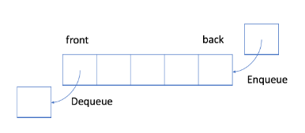
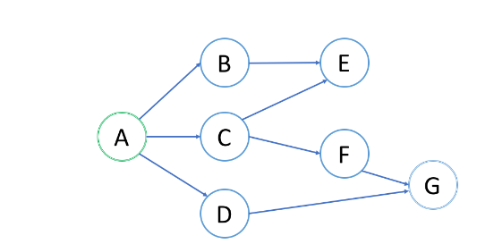
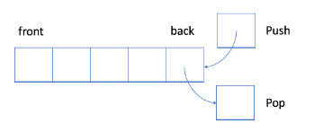

## 介绍

在数组中，我们可以通过索引访问**随机**元素。 但是，在某些情况下，我们可能想要限制**顺序**。

`先入先出 (FIFO)` 和`后入先出 (LIFO)`；以及两个相应的线性数据结构，`队列`和`栈`。

## 队列：先入先出的数据结构

> 跟生活中的在餐厅、医院、售票厅排队一样，排在前面的优先

队列是典型的 FIFO 数据结构。插入（insert）操作也称作入队（enqueue），新元素始终被添加在队列的末尾。 删除（delete）操作也被称为出队（dequeue)。 你只能移除第一个元素。

队列有两个重要的操作，`入队 enqueue `和`出队 dequeue`。

请记住，当你想要`按顺序处理元素`时，使用队列可能是一个很好的选择。

## 队列和广度优先搜索

先决条件：树的层序遍历

`广度优先搜索`（BFS）是一种`遍历或搜索`数据结构（如树或图）的算法。常见应用是找出从根结点到目标结点的最短路径。比如在`图1`中如何使用 BFS 来找出根结点 A 和目标结点 G 之间的最短路径？

## 栈：后入先出的数据结构

在 LIFO 数据结构中，将`首先处理添加到队列`中的`最新元素`。

与队列不同，栈是一个 LIFO 数据结构。通常，插入操作在栈中被称作`入栈 push` 。与队列类似，总是在堆栈的末尾添加一个新元素。但是，删除操作，`退栈 pop` ，将始终删除队列中相对于它的`最后一个元素`。

当你想首先处理`最后一个元素`时，`栈`将是最合适的数据结构。

## 栈和深度优先搜索

与 BFS 类似，深度优先搜索（DFS）也可用于查找从根结点到目标结点的路径。它在 DFS 中找到的[第一条路径](https://leetcode-cn.com/explore/learn/card/queue-stack/219/stack-and-dfs/881/)并不总是最短的路径。与 BFS 不同，更早访问的结点可能不是更靠近根结点的结点。因此，你在 DFS 中找到的第一条路径可能不是最短路径。

## 总结

在前面的章节中，我们介绍了两个数据结构：队列和栈

### 队列
`队列`是一种 `FIFO` 式的数据结构：第一个元素将被首先处理。有两个重要操作：入队和出队。我们可以使用带有两个指针的动态数组来实现队列。

我们可以使用`广度优先搜索（BFS）`。

队列还有一些重要的扩展，例如：

- 双端队列
- 优先队列

### 栈
`栈`是一种 `LIFO` 式的数据结构：最后一个元素将被首先处理。有两个重要操作：`push` 和 `pop`。栈的实现非常简单，使用动态数组就足以实现栈。

当满足 LIFO 原则时，我们使用栈。`深度优先搜索（DFS）`是栈的一个重要应用。

总之，你应该能够理解和比较以下几组概念：

- FIFO 和 LIFO；
- 队列 和 栈；
- BFS 和 DFS。

>lcc :[leetcode-cn](https://leetcode-cn.com/)