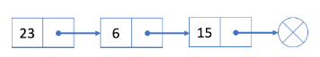
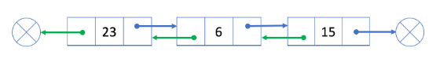

## 概览

## 单链表

单链表中的每个结点不仅包含值，还包含链接到下一个结点的引用字段。通过这种方式，单链表将所有结点按顺序组织起来。、

下面是一个单链表的例子：

蓝色箭头显示单个链接列表中的结点是如何组合在一起的。

在大多数情况下，我们将使用头结点(第一个结点)来表示整个列表。

与数组不同，我们无法在常量时间内访问单链表中的随机元素。 如果我们想要获得第 i 个元素，我们必须从头结点逐个遍历。 我们按索引来访问元素平均要花费 `O(N)` 时间，其中 `N` 是链表的长度。

例如，在上面的示例中，头结点是 23。访问第 3 个结点的唯一方法是使用头结点中的“next”字段到达第 2 个结点（结点 6）; 然后使用结点 6 的“next”字段，我们能够访问第 3 个结点。

你可能想知道为什么链表很有用，尽管它在通过索引访问数据时（与数组相比）具有如此糟糕的性能。 在接下来的两篇文章中，我们将介绍插入和删除操作，你将了解到链表的好处

## 双指针技巧

## 经典问题

## 双链表

双链表以类似的方式工作，但还有一个引用字段，称为“prev”字段。有了这个额外的字段，您就能够知道当前结点的前一个结点。

让我们看一个例子：

绿色箭头表示我们的“prev”字段是如何工作的。

## 小结

让我们简要回顾一下单链表和双链表的表现。

它们在许多操作中是相似的。

- 它们都无法在常量时间内**随机访问数据**。
- 它们都能够在 **O(1) 时间内在给定结点之后或列表开头添加一个新结点**。
- 它们都能够在**O(1) 时间内删除第一个结点**。

但是删除给定结点(包括最后一个结点)时略有不同。

- 在单链表中，它无法获取给定结点的前一个结点，因此在删除给定结点之前我们必须花费 O(N) 时间来找出前一结点。
- 在双链表中，这会更容易，因为我们可以使用“prev”引用字段获取前一个结点。因此我们可以在 O(1) 时间内删除给定结点。

>如果你需要经常添加或删除结点，链表可能是一个不错的选择。如果你需要经常按索引访问元素，数组可能是比链表更好的选择。