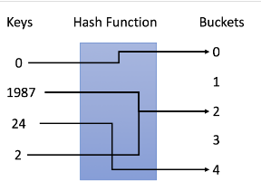

## 概览

哈希表是一种使用**哈希函数**组织数据，以支持快速插入和搜索的数据结构。

有两种不同类型的哈希表：哈希集合和哈希映射。

- 哈希集合是**集合**数据结构的实现之一，用于存储**非重复值**。
- 哈希映射是**映射**数据结构的实现之一，用于存储`(key, value)`键值对。

在标准模板库的帮助下，哈希表是易于使用的。大多数常见语言（如Java，C ++ 和 Python）都支持哈希集合和哈希映射。通过选择合适的哈希函数，**哈希表可以在`插入`和`搜索`方面实现出色的性能**。

通过本章学习，我们将回答以下问题：

- 哈希表的原理是什么？
- 如何设计哈希表？
- 如何使用哈希集来解决与重复相关的问题？
- 如何使用哈希映射按键聚合信息？
- 如何在使用哈希表时设计正确的键？

## 设计哈希表

### 哈希表原理

哈希表的关键思想是使用哈希函数将键映射到存储桶。更确切地说，

- 当我们插入一个新的键时，哈希函数将决定该键应该分配到哪个桶中，并将该键存储在相应的桶中；
- 当我们想要搜索一个键时，哈希表将使用相同的哈希函数来查找对应的桶，并只在特定的桶中进行搜索。

在示例中，我们使用 `y = x ％ 5` 作为哈希函数。让我们使用这个例子来完成插入和搜索策略：

- 插入：我们通过哈希函数解析键，将它们映射到相应的桶中。
    - 例如，1987 分配给桶 2，而 24 分配给桶 4。
- 搜索：我们通过相同的哈希函数解析键，并仅在特定存储桶中搜索。
    - 如果我们搜索 1987，我们将使用相同的哈希函数将1987 映射到 2。因此我们在桶 2 中搜索，我们在那个桶中成功找到了 1987。
    - 例如，如果我们搜索 23，将映射 23 到 3，并在桶 3 中搜索。我们发现 23 不在桶 3 中，这意味着 23 不在哈希表中。

## 实际应用-哈希集合

哈希集是集合的实现之一，它是一种存储**不重复值**的数据结构。

## 实际应用-哈希映射

哈希映射是用于存储 `(key, value)` 键值对的一种实现。

## 实际应用-设计键

## 小结