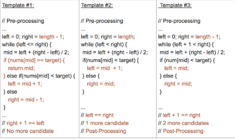

## 概览

二分查找是计算机科学中最基本、最有用的算法之一。 它描述了在有序集合中搜索特定值的过程。

二分查找中使用的术语：

* 目标 Target —— 你要查找的值
* 索引 Index —— 你要查找的当前位置
* 左、右指示符 Left，Right —— 我们用来维持查找空间的指标
* 中间指示符 Mid —— 我们用来应用条件来确定我们应该向左查找还是向右查找的索引

## 背景

在最简单的形式中，二分查找对具有指定左索引和右索引的连续序列进行操作。这就是所谓的查找空间。二分查找维护查找空间的左、右和中间指示符，并比较查找目标或将查找条件应用于集合的中间值；如果条件不满足或值不相等，则清除目标不可能存在的那一半，并在剩下的一半上继续查找，直到成功为止。如果查以空的一半结束，则无法满足条件，并且无法找到目标。

二分查找是一种在每次比较之后将查找空间一分为二的算法。每次需要查找集合中的索引或元素时，都应该考虑二分查找。如果集合是无序的，我们可以总是在应用二分查找之前先对其进行排序。

二分查找一般由三个主要部分组成：

1. 预处理 —— 如果集合未排序，则进行排序。
2. 二分查找 —— 使用循环或递归在每次比较后将查找空间划分为两半。
3. 后处理 —— 在剩余空间中确定可行的候选者。

## 模板1

### 模板 #1

```python
def binarySearch(nums, target):
    """
    :type nums: List[int]
    :type target: int
    :rtype: int
    """
    if len(nums) == 0:
        return -1

    left, right = 0, len(nums) - 1
    while left <= right:
        mid = (left + right) // 2
        if nums[mid] == target:
            return mid
        elif nums[mid] < target:
            left = mid + 1
        else:
            right = mid - 1

    # End Condition: left > right
    return -1
```
模板 #1 是二分查找的最基础和最基本的形式。这是一个标准的二分查找模板，大多数高中或大学会在他们第一次教学生计算机科学时使用。模板 #1 用于查找可以通过访问数组中的单个索引来确定的元素或条件。

### 关键属性

* 二分查找的最基础和最基本的形式。
* 查找条件可以在不与元素的两侧进行比较的情况下确定（或使用它周围的特定元素）。
* 不需要后处理，因为每一步中，你都在检查是否找到了元素。如果到达末尾，则知道未找到该元素。

### 区分语法

* 初始条件：`left = 0, right = length-1`
* 终止：`left > right`
* 向左查找：`right = mid-1`
* 向右查找：`left = mid+1`

## 模板2

### 模板 #2

```python
def binarySearch(nums, target):
    """
    :type nums: List[int]
    :type target: int
    :rtype: int
    """
    if len(nums) == 0:
        return -1

    left, right = 0, len(nums)
    while left < right:
        mid = (left + right) // 2
        if nums[mid] == target:
            return mid
        elif nums[mid] < target:
            left = mid + 1
        else:
            right = mid

    # Post-processing:
    # End Condition: left == right
    if left != len(nums) and nums[left] == target:
        return left
    return -1
```
模板 #2 是二分查找的高级模板。它用于查找需要访问数组中当前索引及其直接右邻居索引的元素或条件。


### 关键属性

* 一种实现二分查找的高级方法。
* 查找条件需要访问元素的直接右邻居。
* 使用元素的右邻居来确定是否满足条件，并决定是向左还是向右。
* 保证查找空间在每一步中至少有 2 个元素。
* 需要进行后处理。 当你剩下 1 个元素时，循环 / 递归结束。 需要评估剩余元素是否符合条件。

### 区分语法

* 初始条件：`left = 0, right = length`
* 终止：`left == right`
* 向左查找：`right = mid`
* 向右查找：`left = mid+1`

## 模板3

### 模板 #3

```python
def binarySearch(nums, target):
    """
    :type nums: List[int]
    :type target: int
    :rtype: int
    """
    if len(nums) == 0:
        return -1

    left, right = 0, len(nums) - 1
    while left + 1 < right:
        mid = (left + right) // 2
        if nums[mid] == target:
            return mid
        elif nums[mid] < target:
            left = mid
        else:
            right = mid

    # Post-processing:
    # End Condition: left + 1 == right
    if nums[left] == target: return left
    if nums[right] == target: return right
    return -1
```

模板 #3 是二分查找的另一种独特形式。 它用于搜索需要访问当前索引及其在数组中的直接左右邻居索引的元素或条件。

### 关键属性

* 实现二分查找的另一种方法。
* 搜索条件需要访问元素的直接左右邻居。
* 使用元素的邻居来确定它是向右还是向左。
* 保证查找空间在每个步骤中至少有 3 个元素。
* 需要进行后处理。 当剩下 2 个元素时，循环 / 递归结束。 需要评估其余元素是否符合条件。

### 区分语法

* 初始条件：`left = 0, right = length-1`
* 终止：`left + 1 == right`
* 向左查找：`right = mid`
* 向右查找：`left = mid`

## 模板分析

你在网上看到的 99% 的二分查找问题会归结于这 3 个模板中的一个。有些问题可以使用多个模板来实现，但是当你做更多的练习时，你会注意到一些模板比其他模板更适合某些问题。

注意：模板和它们的差异已被彩色标注如下：



这 3 个模板的不同之处在于：

* 左、中、右索引的分配。
* 循环或递归终止条件。
* 后处理的必要性。

模板 #1 和 #3 是最常用的，几乎所有二分查找问题都可以用其中之一轻松实现。模板 #2 更 高级一些，用于解决某些类型的问题。

这 3 个模板中的每一个都提供了一个特定的用例：

模板 #1 (`left <= right`)：

* 二分查找的最基础和最基本的形式。
* 查找条件可以在不与元素的两侧进行比较的情况下确定（或使用它周围的特定元素）。
* 不需要后处理，因为每一步中，你都在检查是否找到了元素。如果到达末尾，则知道未找到该元素。

模板 #2 (`left < right`)：

* 一种实现二分查找的高级方法。
* 查找条件需要访问元素的直接右邻居。
* 使用元素的右邻居来确定是否满足条件，并决定是向左还是向右。
* 保证查找空间在每一步中至少有 2 个元素。
* 需要进行后处理。 当你剩下 1 个元素时，循环 / 递归结束。 需要评估剩余元素是否符合条件。

模板 #3 (`left + 1 < right`)：

* 实现二分查找的另一种方法。
* 搜索条件需要访问元素的直接左右邻居。
* 使用元素的邻居来确定它是向右还是向左。
* 保证查找空间在每个步骤中至少有 3 个元素。
* 需要进行后处理。 当剩下 2 个元素时，循环 / 递归结束。 需要评估其余元素是否符合条件。

时间和空间复杂度：

时间：`O(log n)` —— 算法时间

因为二分查找是通过对查找空间中间的值应用一个条件来操作的，并因此将查找空间折半，在更糟糕的情况下，我们将不得不进行 O(log n) 次比较，其中 n 是集合中元素的数目。

> 为什么是 `log n`？
>  - 二分查找是通过将现有数组一分为二来执行的。
>  - 因此，每次调用子例程(或完成一次迭代)时，其大小都会减少到现有部分的一半。
>  - 首先 `N` 变成 `N/2`，然后又变成 `N/4`，然后继续下去，直到找到元素或尺寸变为 `1`。
>  - 迭代的最大次数是 `log N (base 2)` 。

空间：`O(1)` —— 常量空间

虽然二分查找确实需要跟踪 3 个指标，但迭代解决方案通常不需要任何其他额外空间，并且可以直接应用于集合本身，因此需要 O(1) 或常量空间。


## 小结