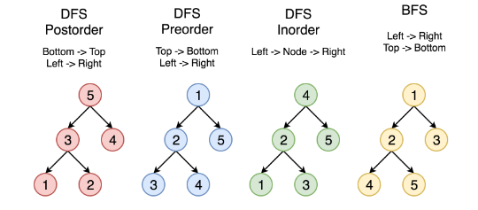

## 概览

`树` 是一种经常用到的数据结构，用来模拟具有树状结构性质的数据集合。

树里的每一个节点有一个根植和一个包含所有子节点的列表。从图的观点来看，树也可视为一个拥有`N` 个节点和`N-1` 条边的一个有向无环图。

`二叉树`是一种更为典型的树树状结构。如它名字所描述的那样，二叉树是每个节点最多有`两个子树`的树结构，通常子树被称作“左子树”和“右子树”。

完成这张卡片后，你将：

* 掌握树和二叉树的概念
* 熟悉不同的遍历方法
* 运用递归解决二叉树相关题目

## 树的遍历

### 深度优先搜索（DFS）

在这个策略中，我们采用 `深度` 作为优先级，以便从跟开始一直到达某个确定的叶子，然后再返回根到达另一个分支。深度优先搜索策略又可以根据根节点、左孩子和右孩子的相对顺序被细分为 `前序遍历`，`中序遍历`和`后序遍历`。

* `前序遍历`: 前序遍历首先访问根节点，然后遍历左子树，最后遍历右子树。
* `中序遍历`:中序遍历是先遍历左子树，然后访问根节点，然后遍历右子树。
* `后序遍历`:后序遍历是先遍历左子树，然后遍历右子树，最后访问树的根节点。

> `根左右` 为前序、`左根右` 为中序、`左右根` 为后序。主要看 `根` 在 ` 左右` 的位置。

### 宽度优先搜索（BFS）

我们按照高度顺序一层一层的访问整棵树，高层次的节点将会比低层次的节点先被访问到。

下图中的顶点按照访问的顺序编号，按照 1-2-3-4-5 的顺序来比较不同的策略。

## 运用递归解决问题

>todo

## 小结
