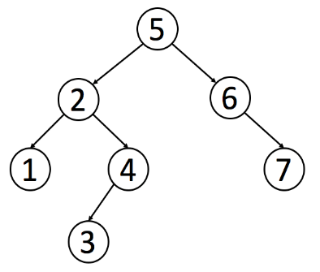

## 概览

二叉搜索树是二叉树的一种特殊形式。 二叉搜索树具有以下性质：每个节点中的值必须大于（或等于）其左侧子树中的任何值，但小于（或等于）其右侧子树中的任何值。

## 二叉搜索树简介

二叉搜索树（BST）是二叉树的一种特殊表示形式，它满足如下特性：

* 每个节点中的值必须大于（或等于）存储在其左侧子树中的任何值。
* 每个节点中的值必须小于（或等于）存储在其右子树中的任何值。

下面是一个二叉搜索树的例子：

像普通的二叉树一样，我们可以按照前序、中序和后序来遍历一个二叉搜索树。 但是值得注意的是，对于二叉搜索树，我们可以通过`中序遍历`得到一个`递增的`有序序列。因此，中序遍历是二叉搜索树中最常用的遍历方法。

## 二叉搜索树中的基本操作

二叉搜索树主要支持三个操作：搜索、插入和删除。

### 搜索

根据BST的特性，对于每个节点：

* 如果目标值等于节点的值，则返回节点;
* 如果目标值小于节点的值，则继续在左子树中搜索;
* 如果目标值大于节点的值，则继续在右子树中搜索。

### 插入

二叉搜索树中的另一个常见操作是插入一个新节点。有许多不同的方法去插入新节点，这篇文章中，我们只讨论一种使整体操作变化最小的经典方法。 它的主要思想是为目标节点找出合适的叶节点位置，然后将该节点作为叶节点插入。 因此，搜索将成为插入的起始。

与搜索操作类似，对于每个节点，我们将：

1. 根据节点值与目标节点值的关系，搜索左子树或右子树；
2. 重复步骤 1 直到到达外部节点；
3. 根据节点的值与目标节点的值的关系，将新节点添加为其左侧或右侧的子节点。

这样，我们就可以添加一个新的节点并依旧维持二叉搜索树的性质。

### 删除

删除要比我们前面提到过的两种操作复杂许多。有许多不同的删除节点的方法，这篇文章中，我们只讨论一种使整体操作变化最小的方法。我们的方案是用一个合适的子节点来替换要删除的目标节点。根据其子节点的个数，我们需考虑以下三种情况：

1. 如果目标节点没有子节点，我们可以直接移除该目标节点。
2. 如果目标节只有一个子节点，我们可以用其子节点作为替换。
3. 如果目标节点有两个子节点，我们需要用其中序后继节点或者前驱节点来替换，再删除该目标节点。

## 小结