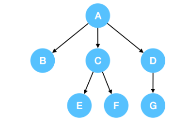

## 概览

二叉树是一棵以根节点开始，每个节点含有不超过2个子节点的树。 让我们将这个定义扩展到`N`叉树。 一棵以根节点开始，每个节点不超过`N`个子节点的树，称为`N`叉树。

`前缀树`，又称`字典树(Trie)`， 就是一个常用的`N叉树`。

## 遍历

### 树的遍历

一棵二叉树可以按照前序、中序、后序或者层序来进行遍历。在这些遍历方法中，前序遍历、后序遍历和层序遍历同样可以运用到N叉树中。

> 回顾二叉树的遍历
> * 前序遍历 - 首先访问根节点，然后遍历左子树，最后遍历右子树；
> * 中序遍历 - 首先遍历左子树，然后访问根节点，最后遍历右子树；
> * 后序遍历 - 首先遍历左子树，然后遍历右子树，最后访问根节点；
> * 层序遍历 - 按照从左到右的顺序，逐层遍历各个节点。

请注意，N叉树的中序遍历没有标准定义，中序遍历只有在二叉树中有明确的定义。尽管我们可以通过几种不同的方法来定义N叉树的中序遍历，但是这些描述都不是特别贴切，并且在实践中也不常用到，所以我们暂且跳过N叉树中序遍历的部分。

把上述关于二叉树遍历转换为N叉树遍历，我们只需把如下表述:

> 把上述关于二叉树遍历转换为N叉树遍历，我们只需把如下表述:

变为:

> 对于每个子节点:
>    通过递归地调用遍历函数来遍历以该子节点为根的子树

我们假设for循环将会按照各个节点在数据结构中的顺序进行遍历：通常按照从左到右的顺序，如下所示。

### N叉树遍历示例

1. 前序遍历
在N叉树中，前序遍历指先访问根节点，然后逐个遍历以其子节点为根的子树。
例如，上述三叉树的前序遍历是: A->B->C->E->F->D->G.

2. 后序遍历
在N叉树中，后序遍历指前先逐个遍历以根节点的子节点为根的子树，最后访问根节点。
例如，上述三叉树的后序遍历是: B->E->F->C->G->D->A.

3. 层序遍历
N叉树的层序遍历与二叉树的一致。通常，当我们在树中进行广度优先搜索时，我们将按层序的顺序进行遍历。
例如，上述三叉树的层序遍历是: A->B->C->D->E->F->G.

## 递归

> todo

## 小结