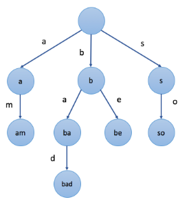

## 概览

前缀树，又称字典树，是`N`叉树的**特殊**形式。

你将：

* 理解前缀树的基本概念
* 掌握前缀树中的插入和搜索操作
* 了解前缀树如何帮助解决实际应用问题
* 运用前缀树解题

## 前缀树简介

`前缀树`是`N叉树`的一种特殊形式。通常来说，一个前缀树是用来`存储字符串`的。前缀树的每一个节点代表一个`字符串`（`前缀`）。每一个节点会有多个子节点，通往不同子节点的路径上有着不同的字符。子节点代表的字符串是由节点本身的`原始字符串`，以及`通往该子节点路径上所有的字符`组成的。

下面是前缀树的一个例子：

在上图示例中，我们在节点中标记的值是该节点对应表示的字符串。例如，我们从根节点开始，选择第二条路径 'b'，然后选择它的第一个子节点 'a'，接下来继续选择子节点 'd'，我们最终会到达叶节点 "bad"。节点的值是由从根节点开始，与其经过的路径中的字符按顺序形成的。

值得注意的是，根节点表示`空字符串`。

前缀树的一个重要的特性是，节点所有的后代都与该节点相关的字符串有着共同的前缀。这就是`前缀树`名称的由来。

我们再来看这个例子。例如，以节点 "b" 为根的子树中的节点表示的字符串，都具有共同的前缀 "b"。反之亦然，具有公共前缀 "b" 的字符串，全部位于以 "b" 为根的子树中，并且具有不同前缀的字符串来自不同的分支。

前缀树有着广泛的应用，例如自动补全，拼写检查等等。

## 基本操作

## 实际应用1

## 实际应用2