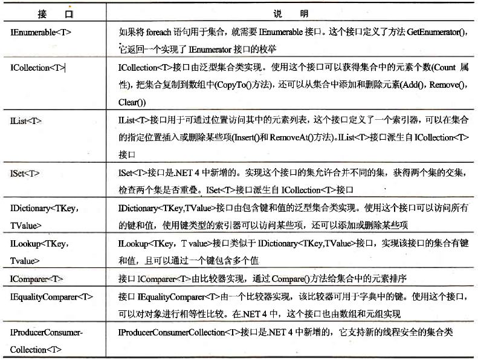
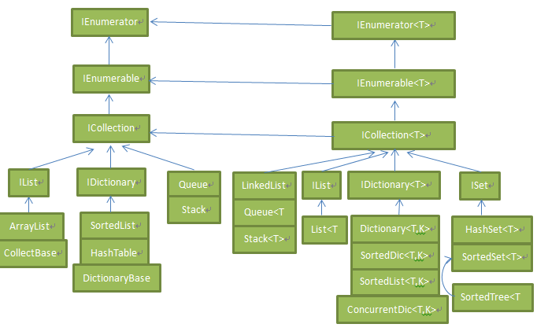
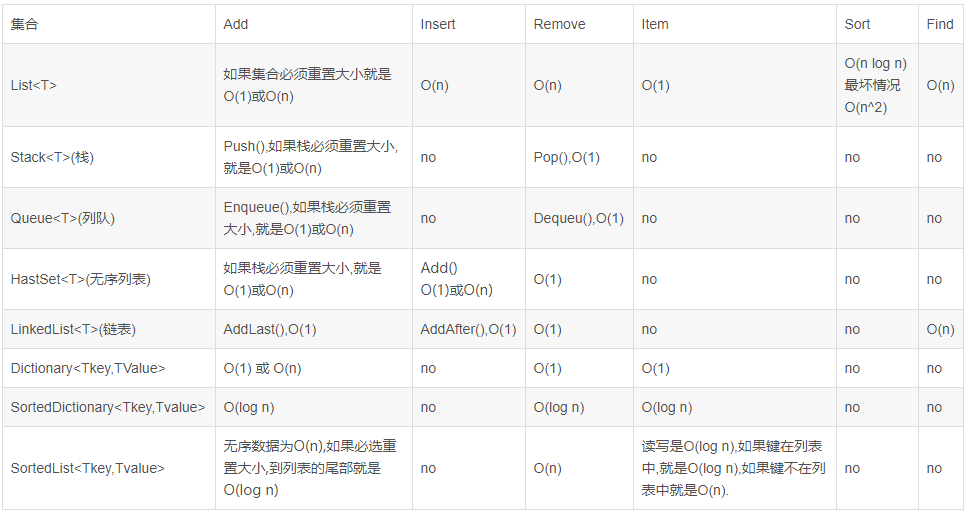
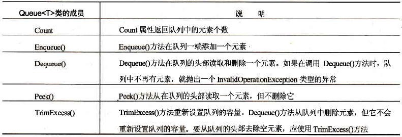
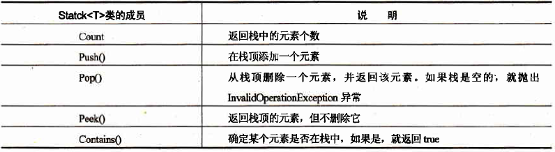
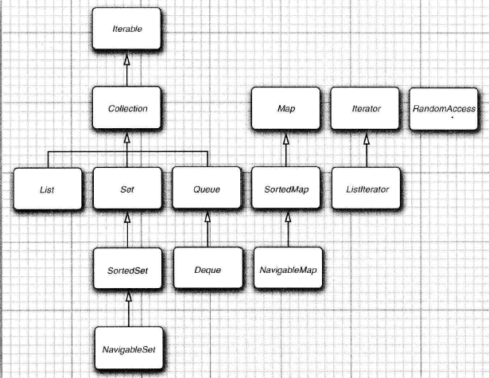
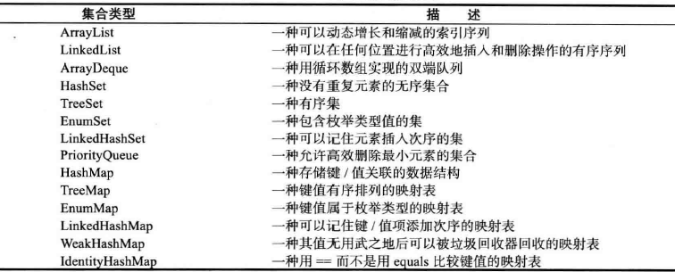
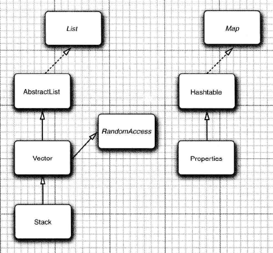

## C#

数组的大小是固定的。如果元素的个数是动态的，那么就应该应用集合。

大多数集合类都可在`system.Collections`和`system.Collections.Genenc`名称空间中找到。泛型集
合类位于`system.Collections.Genenc`名称空间中，专用于特定类型的集合类位于`system.Collections.Specialized`名称空间中，线程安全的集合类位于`system.Collections.Concurrent`名称空
间中。

集合和列表实现的接口如下表：

各集合类和接口的关系如下表：

各集合及执行不同操作的性能如下表：

### 列表： `List<T>`，`ArrayList`

`List<T>` 是泛型类，实现了 `IList`、`ICollection`、`IEnumerable`,`IList<T>`、`ICollection<T>` 和 `IEnumerable<T>` 接口。

`ArrayList` 是非泛型类，可以将任何 `Object` 类型作为其元素,存在装箱拆箱的操作开销，尽量少用，以提高性能。

### 队列： `Queue<T>`

先进先出（FIFO）。如同生活中在餐厅排队打饭，先到先得，排在前面的先打。

队列使用 `system.Collections.Genenc` 名称空间中的泛型类   `Queue<T>` 实现。在内部， `Queue<T>` 类使用 `T` 类型的数组，这类似于 `List<T>` 类型。它实现 `ICollection` 和  `IEnumerable<T>` ，但没有实现 `ICollection<T>` 接口，因为这个接口定义的 `Add()` 和 `Rmove()` 方法不能用于队列。

因为 `Queue<T>` 没有实现 `IList<T>` 接口,所以不能用索引器访问队列。队列只允许在队列中添加元素,该元素会放在队列的尾部(使用 `Enqueue()` 方法),从队列的头部获取元素(使用 `Dequeue()` 
方法)。

`Queue<T>`类成员如下表：

### 栈： `Statck<T>`

后进先出（LIFO）。

与 `Queue<T>` 类相同， `Statck<T>` 类实现 `ICollection` 和  `IEnumerable<T>` 接口。

`Statck<T>`类成员如下表：

### 链表：`LinkedList<T>`

`LinkedList<T>`是一个双向链表。

### 有序表：`SortedList<TKey,TValue>`

### 字典： `Dictionary<TKey,TValue>`, `Lookup<TKey,TValue>`, `SortedDictionary<TKey,TValue>`

`SortedDictionary<TKey,TValue>`类是一个二叉搜索树。

### 集： `HashSet<T>`, `SortedSet<T>`

`HashSet<T>` 集包含不重复元素的无序列表。`SortedSet<T>` 集包含不重复元素的有序列表，它们都实现了 `ISet<T>`接口。

### 可观察集合： `ObservableCollection<T>`

### 位数组： `BitArray`, `BitVector32`

### 并发集合：

## Java

集合框架的接口关系如下表：

java库中具体的集合类如下表:

java库中集合框架中的类关系如下表:

java库中集合框架中遗留的类关系如下表:

### 链表：`LinkedList`

### 数组列表： `ArrayList`, `Vector`

在需要动态数组时， 可能会使用 `Vector` 类。为什么要用 `ArrayList` 取代Vector 呢？ 原因很简单：`Vector` 类的所有方法都是同步的。可以由两个线程安全地访问一个 `Vector` 对象。但是， 如果由一个线程访问 `Vector`, 代码要在同步操作上耗费大量的时间。这种情况还是很常见的。而 `ArrayList` 方法不是同步的，因此， 建议在不需要同步时使用 `ArrayList`, 而不要使用`Vector`。

java 可以使用泛型和非泛型的 `ArrayList`，比如`ArrayList<String> myAL =new ArrayList<String>()`和 `ArrayList myAL = new ArrayList()`，在C#中 `ArrayList` 不支持泛型，只能是`ArrayList myAL = new ArrayList()`，需要泛型的话可以使用 `List<T>` 来替代。

### 散列表：  `HashSet`

### 树集： `TreeSet`

### 队列与双端队列

### 映射(键值对)： `HashMap`, `TreeMap`

> C#中没有 `HashMap`，但可以使用字典。

Java 类库为映射提供了两个通用的实现：`HashMap` 和 `TreeMap`。这两个类都实现了`Map` 接口。

### HashTable

`Hashtable` 类与 `HashMap` 类的作用一样， 实际上， 它们拥有相同的接口。与 `Vector` 类的方法一样。 `Hashtable` 的方法也是同步的。如果对同步性或与遗留代码的兼容性没有任何要求，就应该使用 `HashMap`。如果需要并发访问， 则要使用 `ConcurrentHashMap`。

### 枚举

### 栈

### 位集