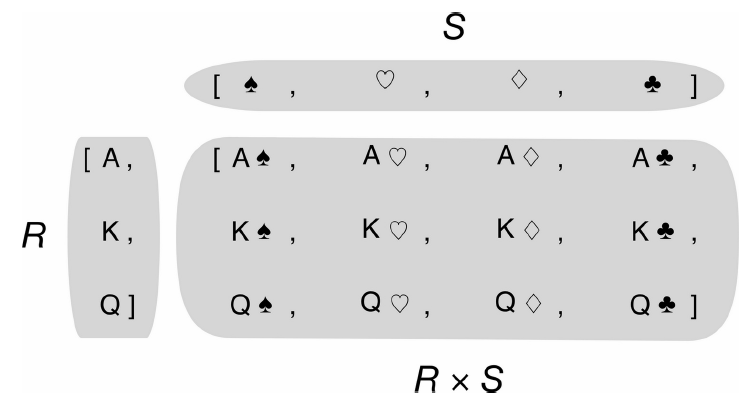

## 定义

笛卡尔乘积是指在数学中，两个集合 `A`和 `B` 的笛卡尔积（`Cartesian product`），又称直积，表示为`A × B`，第一个对象是X的成员而第二个对象是Y的所有可能有序对的其中一个成员

示例1：
- `A = {1,2}`
- `B = {a,b,c}`
- `A × B ={(1,a),(1,b),(1,c),(2,a),(2,b),(2,c)}`

示例2：




## `python` 实现

如果你需要一个列表，列表里是 `3` 种不同尺寸（`S`,`M`,`L`）的 `T` 恤衫，每个尺寸都有 `2` 个颜色（`black`,`white`）。


```python
>>> colors = ['black', 'white']
>>> sizes = ['S', 'M', 'L']
>>> tshirts = [(color, size) for color in colors for size in sizes]
>>> tshirts
[('black', 'S'), ('black', 'M'), ('black', 'L'), ('white', 'S'), ('white', 'M'), ('white', 'L')]
```